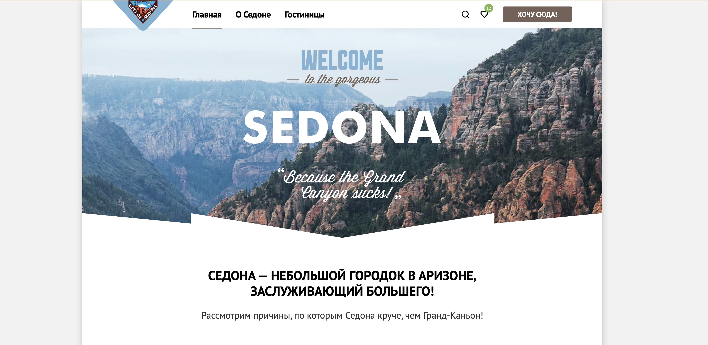

# Личный проект «Седона»

- Студент: [Ксения Дудак](https://up.htmlacademy.ru/htmlcss/39/user/917321).
- Наставник: [Ирина Малиновская](https://htmlacademy.ru/profile/irina-malinovskaya).
- Сайт: (https://dxenium.github.io/HTML-Academy-Sedona/).

---

Репозиторий создан для обучения на профессиональном онлайн‑курсе «[HTML и CSS. Профессиональная вёрстка сайтов](https://htmlacademy.ru/intensive/htmlcss)» от [HTML Academy](https://htmlacademy.ru).
